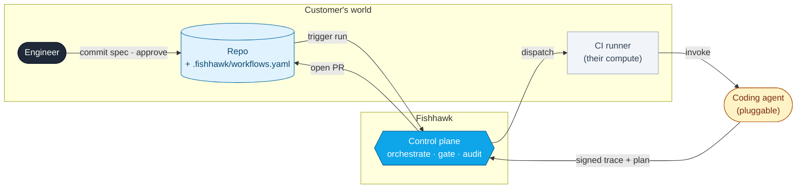
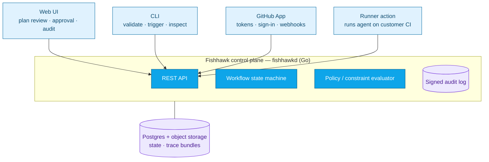
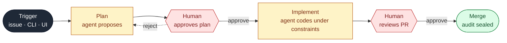

# Fishhawk — System Overview

> Executive-level architecture. For the technical realization, see [`docs/ARCHITECTURE.md`](../ARCHITECTURE.md).

**Fishhawk is the governed, auditable workflow for agent-driven software changes.** Teams commit a workflow spec to their repo; Fishhawk runs the coding agent under typed constraints, captures a signed audit trail, and gates every stage on human approval.

---

## What it is

The agent runs on the **customer's own CI** — Fishhawk never holds their code. Fishhawk owns orchestration, policy, approvals, and the immutable audit record.

---

## The five surfaces

| Surface | Role |
|---|---|
| **Control plane** (`fishhawkd`) | The brain: workflow state, policy, approvals, audit, API. |
| **Runner** | Executes the agent on the customer's CI; signs and ships the trace. |
| **Web UI** | Where humans review plans, approve, and search the audit history. |
| **CLI** | Validate specs and drive runs from the terminal. |
| **GitHub App** | Repo access, user sign-in, and the webhook triggers. |

---

## How a change flows — and where humans decide

**Every agent action is bounded by typed constraints and bracketed by a human gate.** Plans can be rejected back to the agent; implementation is checked against the approved scope before a PR ever opens; nothing merges without review. The full run is captured as a cryptographically signed, append-only audit trail.

---

## Why it matters

- **Control** — typed constraints (allowed paths, file limits, required outcomes) enforced automatically, not by convention.
- **Accountability** — every plan, approval, and diff is signed and immutable; "who approved what, when" is always answerable.
- **Trust boundary** — agents run on the customer's compute; Fishhawk governs without holding the code.
- **Pluggable** — the coding agent is swappable; the governance model is the product.
